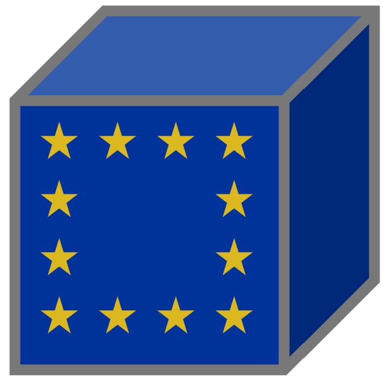

#   Eurostat Data Cube 

[](https://doi.org/10.5281/zenodo.18682075)

This is your unnofficial data cube gateway to [eurostat](https://ec.europa.eu/eurostat/en/), allowing you to use temporal census data in [xarray](https://docs.xarray.dev/en/latest/index.html), e.g., to combine it with satellite imagery.

## Get Started

Download the [dataset](https://zenodo.org/records/18682075) and open an array in python:

```python
import urllib.request
import netCDF4
import xarray as xr

path = "eurostat-datacube.nc"
urllib.request.urlretrieve("https://zenodo.org/records/18682075/files/eurostat-datacube.nc?download=1", path)
dt = xr.open_datatree(path)
```
Get the array showing percentage of 20 to 24 year old males with higher education by region and time:

```python
dt.edat_lfse_04.a_pc_y20_24_ed3_4_m
```
```
<xarray.DataArray 'a_pc_y20_24_ed3_4_m' (geo: 1210, time: 84)> Size: 813kB
[101640 values with dtype=float64]
Coordinates:
  * geo      (geo) <U5 24kB 'AT111' 'AT112' 'AT113' ... 'SK032' 'SK041' 'SK042'
  * time     (time) datetime64[ns] 672B 2001-01-01 2001-04-01 ... 2021-10-01
Attributes:
    freq:       Annual
    unit:       Percentage
    group:      Y20-24 ED3_4 M
    age:        From 20 to 24 years
    isced11:    Upper secondary and post-secondary non-tertiary education (le...
    sex:        Males
    frac_na:    0.0323888232979143
    long_name:  Population in private households in Y20-24 ED3_4 M
    title:      Population in private households by educational attainment le...
    doi:        https://doi.org/10.2908/edat_lfse_04
```

The data was generated by running the workflow in file [`_targets.R`](_targets.R).

## Motivation

Statistical data collection is designed to show the spatial distribution of features at a given reporting period.
This makes it easy to generate a map but difficult to analyse time series.
Some features are reported monthly, others annually.
In addition, statistical [NUTS](https://ec.europa.eu/eurostat/en/web/nuts) regions may change their name, id, and even boundaries over time, making it challenging to track what happened at a given geographical region.
This project provides a harmonised and aggregated view on eurostat data, providing arrays with constant spatiotemporal boundaries.

## Features

- follows xarray and [CF Conventions](https://cfconventions.org/)
- bulk download of eurostat including meta data
- All regions are aggregated or upsampled to NUTS3 as of version 2024
- All timespans are aggregated or upsampled to quarters
- Accounts for NUTS region splits and merges weighted by population using [nuts::nuts_convert_version](https://docs.ropensci.org/nuts/reference/nuts_convert_version.html)

## Build

This repo only contains the code required to build the actual datacube. To build your own, run:

```bash
git clone https://github.com/danlooo/eurostat-datacube
cd eurostat-datacube
docker compose up --build
```

Alternatively , it can be excuted rootlessly using Apptainer/Singularity:

```bash
singularity run --bind $PWD/_targets:/work/_targets --workdir /work docker://danlooo/eurostat-datacube \
    bash -c 'cd /work && R -e "targets::tar_make()"'
```

## Disclaimer

This project is a re-analysis of the official data of eurostat.
Values were modified during aggragation.
The codebase may still contain errors that can lead to false interpretation of the data.
Use the products at your own risk.
We are not affiliated with eurostat.


## Funding

<p>
<a href = "https://earthmonitor.org/">

</a>

<a href = "https://earthmonitor.org/">

</a>
</p>

This project has received funding from the [Open-Earth-Monitor Cyberinfrastructure](https://earthmonitor.org/) project that is part of European Union's Horizon Europe research and innovation programme under grant [101059548](https://cordis.europa.eu/project/id/101059548).
